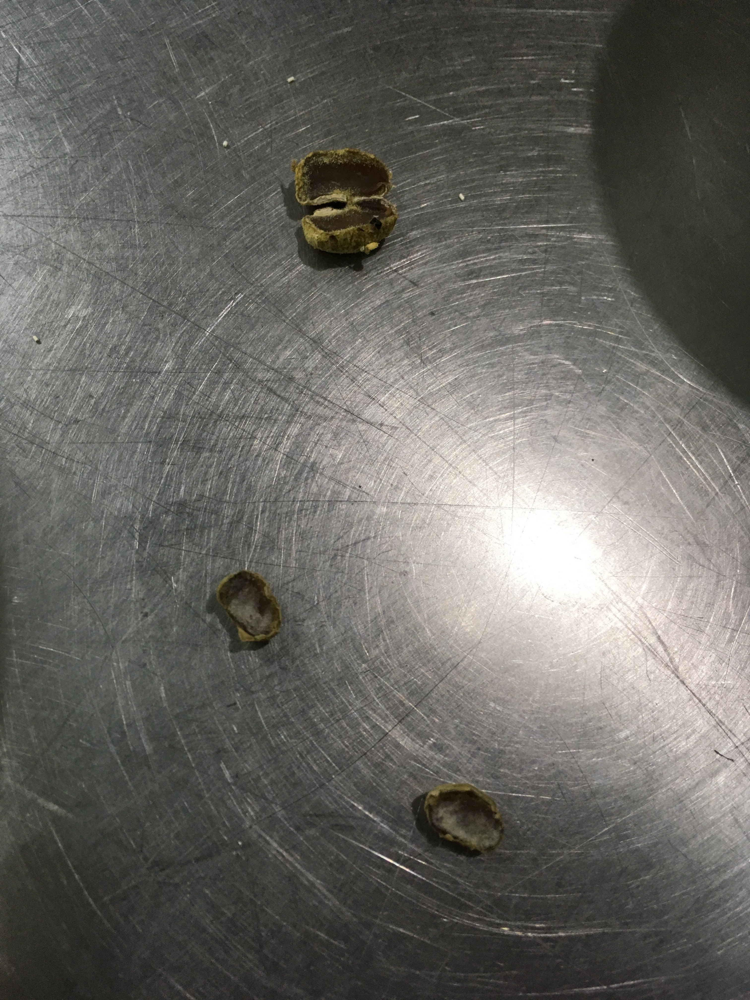

# 日本麴

## 麴菌概論

* 根黴菌(真菌)的一種
  * 需要乾燥的表面攀附（所以不能太濕，禁明水）
  * 一般生長附著物的含水量約為50-60%
* 製作過程中會產生熱度，36度以上最佳，但又不能超過38度（燒麴）
  * 燒麴會發生氨味、臭菇味
* 環境控制很重要
  * 濕度85% 不過乾也不過濕
  * 環境溫度低於28沒那麼好做
  * 低於15度幾乎不會燒麴
* 保持乾淨是絕對的
  * 布不要沾到麴
  * 底巾濕掉要換
  * 有水氣要擦乾
  * 忌諱明水

### 日本四大麴：春夏秋冬
* 京都白雪：花香系，不燒麴（溫度過高導致異常），成功率高，等級較低，不過已經有做了改良
* 白神山花果香偏花香(些微差距)，酵素力價白神山較高
* 等級越高的麴越難搞
* 秋田今野是日本有名的製麴場

### 產膜酵母
* 多是雜菌，在酒體表面上產生一層白色衛生紙狀的薄膜
* 能吸收有機酸與其他養分成長
* 特性是耐酸耐鹽耐酒精(10%)
* 有趣的是，薄膜表面上pH7, 無酒精與有機酸，導致上方成為一個菌的良好載體，提高污染率
* 若表面長花（黴菌）或溶解（腐生菌），就ＧＧ了
* 與醋酸菌不同的地方：醋酸菌的膜較光滑、且有些品種會沿著壁往上長，醋酸菌會吃酒精。
* 產膜酵母在無氧環境下，可以產生香氣，在日本的開放發酵中，產膜酵母是必然發生的，此時會在表面略有產生的時候就會拌入酒中，出現在桶壁的則用手攏起拌入酒中。

### 大麴、小麴
* 中國傳統的菌種做法，使用米、豆、麥、藥草等材料製成糰/餅狀，自然接種養成
* 同時混合根黴菌、酵母等多種菌種，較為複雜難控制

## 其他

有過敏的人完全不要吃發酵物，醬油不能

### 發酵罐
* 雖然要攪拌，但是在罐體不大的情況下，整罐拿起來搖晃也是不錯的選擇，減少開蓋的感染機率。由於搖晃後米可能會附著於罐體邊緣增加感染機率，建議最後搖一下把邊緣的米搖下去
* 發酵罐的深度與直徑的最佳比例是1:1, 這樣可以減少感染

### 保溫
* 大同電鍋保溫的溫度設定是70度，不過實際運作一般會在65度，可以在電鍋上面蓋上布增強保溫
* 電子鍋設定溫度是70度，實際運作是70-72度

### 紫米
* 若想投入紫米一起製作，須先打破紫米（米麴無法滲透）
* 紫糯米是比較好的選擇，不建議使用黑米

### 風格
* 關東口味比關西重

### 雜談

日本的譜常寫單位是公斤，但實際上清酒廠以升為單位（一升=1.8L）

1升=10合，1合=180ml

日本一合米150g 180cc

## 米麴

* 醣化到一半的米，作為菌種使用，有分乾米麴與濕米麴
  * 乾米麴會損失約30-40%酵素活力，香氣也較差，但比較好保存
* 良好的米麴，菌長在外圍，但米心依然保持完好沒被碰觸
* 清潔極度重要，不然做出來的成品容易出現黑斑/七彩等感染現象
* 油脂不會影響麴菌，但那往往是沒有充分清潔的徵兆
* 製麴會損失20%澱粉，長得深一點會損失40%, 但產生香氣、甜味、酵素與營養物質
* 麴是一種真菌（霉）
* 日式米麴拿來做中式豆腐乳之類的效果不錯，有著優雅的香氣
* 用途：鹽麴醬油麴甘酒味增清酒...
* 總流程約40hr，全程高溫高濕，兩個小時起來一次不用睡覺
  * 週五晚上製麴放置睡一晚，週六整天控制溫度到週日，可能中午或下午收工
  * 日本清酒製作種麴都要十幾天，前三天不用睡

### 懶得做直接買
* 少量去找益良食品行買 學員價180$ (原價250$)
* 台北市西寧北路98號 02-25566048
* 老師賣米渠至少10kg起跳

### 設備需求
* 公文藍400號
* 密林藍450號
* 蒸麵包網
* 棉蒸巾
* 粿巾400號 蓋的時候要四層
* 蒸飯巾 30-40$
* 撒麴罐 DIY（玻璃小罐＋醫療消毒紗布10$＋橡皮筋）
* 警報溫度計，方便你不用沒事跑去看溫度（選用）
* 只能用蓬萊米（日本沒有再來米）一盤1-1.5kg

### 最重要的酵素
* 蛋白酵素: 甘味
* 澱粉酵素  
* 脂肪酵素: 甘油 香氣與口感
* 纖維酵素 

鹽麴：主要是蛋白酵素、澱粉酵素

醬油麴：脂肪酵素

### 麴室
* 麴室 36-46度 濕度90% - 冬天做比較舒適
* 木盒法，最好使用麴室，用城牆堆法留空間
* 維持濕度：象印熱水瓶拆掉蓋子製造蒸氣，連接濕度計，低於啟動，高於關閉
  * 日本有賣小型麴室
  * 台灣可以用烘碗機 溫度控制36-38度 放一碗水進去

### 製作
網站上有錄製教學影片，最好要看。這是一個實作經驗很重的，可以去上課一次最清楚
<http://blog.xuite.net/jamestsai888/blog>

#### 衛生乾淨 是絕對的
* 空氣 酒精噴霧，讓灰塵與細菌掉下去飄不起來
* 布 煮過消毒
* 籃子 酒精消毒
* 桌面 酒精消毒
* 飯匙 可以用燒的消毒
* 手 充分清洗 酒精消毒
* 頭巾 避免汗滴下去

#### 洗米
* 要用蒸的不能用煮的（煮的會太軟）
* 一個批次至少要1kg (一盒1.5kg) 量太少有時會做不成
* 用蒸飯巾包起來洗，比較好拿且容易瀝水
* 不要搓，會傷害米粒
* 可以用蓮蓬頭沖
* 如果是做清酒要要求洗到沒有粉，水是清澈的，要洗很久，但又不能洗太久會吸水過度，動作要快

#### 泡米 
* 木製飯斗 1.5hr
* 不鏽鋼蒸鍋 1hr （不鏽鋼鍋外面是冷的裡面是熱的，蒸氣結成水溫度下降，鍋緣會降溫，所以少一點水）

#### 水切（瀝乾）
* 泡完水要瀝水，用巾包起來，扭一下，倒置瀝至少一個小時（不鏽鋼兩小時）倒置可以在蒸的時候把水分逼走

#### 蒸飯
* 只能用蒸的，電鍋可以買電鍋用的蒸籠
* 蒸氣出來開始計時
* 不鏽鋼蒸40min，木製飯斗蒸60min
* 高溫蒸氣是乾的，低溫是濕的
* 水放一兩三碗都行 水要先滾好 煮一鍋水在旁邊等他，中間不能夠斷（從冷的開始會變粥）
* 蒸完邊緣濕濕軟軟的刮掉
* 蒸完要散開，讓蒸氣出去，不然會濕掉
* 底下架一下，避免接觸金屬導致回潮
* 可以用電風扇吹乾
* 手要乾淨才能抓，但小心手燙傷
* 不可以是黏的，要乾到粒粒分明

#### 入麴
* 降溫到38-36度 可以撒麴
* 撒麴罐：已滅菌醫療紗布10$只要一層（消耗品），套在罐口後繃緊以橡皮筋固定，每個網眼都要撐開
* 手指彈一下掉一點，均勻的撒。如果有卡住，可以敲一下網子
* 日本麴很貴，一包做兩石300kg，薄薄一層
* 撒完一層，原地翻轉攤平，繼續撒。翻的時候手順便把結團的米散開，重複到撒完（四次）
* 一般人1kg米2g種麴，師傅級1kg米1g種麴
* 有很多種撒法，有往上敲讓煙霧自然落下增加範圍的，也有用蚊香盒的（米粒狀種麴）
* 米如果有硬硬的，稍微搓一下讓它散開不要黏在一起
* 入麴的容器尺寸：老師家裡三尺六尺，日本那邊是四呎十六呎
* 一般人薪水20-25萬日幣 麴師32萬日幣/月

#### 打堆
* 為了幫米麴保溫
* 把接種完的倒進籃子中的布巾450號（容器記得消毒）
* 拉布巾把米集成一個球，不要有米露在外面為原則，壓緊一點沒壞處
* 1.5kg一堆, 不要太多會不好管理
* 日本是一擔150kg一堆 或一半80kg一堆
* 打堆完，要拿布巾蓋上，四層。若長度不夠可以略為交錯，然後塞進兩個籃子中間夾好 （為了維持濕度與細菌下不來）
* 兩盆可以交疊，下層發熱速度較快，下一個階段就交換位置 
* 不密封要用布蓋的理由：空氣對流與濕度控制
* （黑麴 染色超強 泡盛、醬油 一定穿黑色）（清酒一定穿白色）

#### 第一階段培養
* 約18-22hr，發熱到38度，這是唯一可以休息的時間。
* 超過24hr會燒壞（過熱）

#### 盛 
* 打散，拿起來用手搓不用客氣
* 播到一邊，確認搓開的推過去，以確保每一個都有搓開
* 全身的力氣下去，不用急
* 搓散之後，再度打堆

#### 手入/劃溝
* 檢查點：溫度達38-40度時（大概4-6hr左右）做盛去打散米
* 可以吹風降溫 降到36-37
* 兩隻手作出溝渠狀（山稜狀），幫助散熱
* 另一個流派：堆成一堆，手螺旋狀做個火山口

#### 監控溫度
* 放置到38度再次手入，散熱到36劃溝
* 如果溫度不到，至少六個小時也要做一次（放太久會長毛結團，這個時候就不好處理了）

#### 完成與保存
* 終止條件：當米折成兩半，留有米心50%/菌絲50%(同心圓狀)是最好的。當有80%的米都在這個狀態時，終止發酵
* 不要超過總時間40hr，酵素力價會下降（48hr後必然產生孢子）
* 分裝300g一包放冰箱冷凍保存
  * 凍乾法損失30%、乾燥損失45%、所以冷凍保存就好
* 沒有米心雖然酵素比較強，但是不會有甜味，不是最好的狀態
* 直接吃米麴有栗子的香甜味...應該多做幾次試試看
* 如果放置到孢子長出來之後就不再分泌酵素，下降到70%，要避免這個情況

#### 成品判斷
* 突破精 一點但是有伸進去 師傅級 吟釀在做
* 總破精 一整片，常見
* 馬鹿破精 壞了，東一點西一點

#### 清理
清潔消毒：洗潔精、過碳酸鈉、曬乾烘乾

## 麥麴製作

* 原料美國大麥最佳，大顆且顆粒比較完整（小顆的一斤25$）
* 一斤可做出800-1000g
* 增加的是水分，實際乾重會被麴吃掉20%

做法近似米麴，這裡僅列出差異：

* 使用珍珠薏仁（珍珠麥），這樣才好著菌
* 不需要他的蛋白質：豆子已經夠了
* 麥子比米容易吸水，所以泡的時間要短，瀝的時間要長
* 泡水1hr、水切2hr
* 蒸40min（蒸籠）或 1hr(飯斗)
* 剩下跟做米麴都一樣
* 打堆一次就好，不需要做盛！很好做麴，一樣京都白雪
* 42-45hr可以收，不超過48hr
* 沒辦法折開來看狀況
* 味道比較香？草腥味？需要自己嘗試

## 小麥麴

進階者向

需要發芽去破皮，略微破開就好，根不能出來。效果會比拿去做精米來得好

發芽：泡水6hr（不超過8hr），水切，每2hr衝一次水（沖掉霉菌），持續2-3days

## 豆麴製作

比豆麥麴難度高一點，因為時間長60~72hr。（黑豆更長72hr up）

### 材料
* 大豆1kg（蒸熟後約2kg）
* 高筋麵粉/麥粉 100g (10%) （春麥最佳，蛋白質越高越好）
* 種麴 2-5g (0.2~0.5%)
  * 菌種 勝鬨橋 醬油用豆麴種麴

### 流程

* 黃豆或黑豆
  * 洗豆：清洗大豆或黑豆，挑去不良豆與浮豆
  * 浸泡：三倍水泡六小時
  * 蒸煮：蒸得比較不會殘留太多水份，大火蒸豆1-1.5hr(視豆子數量增加)（一公斤乾豆泡水成兩公斤濕豆蒸一個小時）
  * 煮完之後散熱與散去水氣，求表面乾爽
* 麵粉
  * 均質菌種，控制濕氣，成功率較高
  * 麵粉也要炒過，會更安全水份也更少
  * 炒到金黃色，嚐起來感覺熟香即可
* 一點麵粉與菌種混勻，然後與豆子拌勻裹上
* 再加麵粉裹勻控制濕氣後，入籃
  * 入籃厚度約2-3cm（手指一節半）
  * 密林籃鋪底巾（棉蒸巾），蓋上粿巾（類似米麴）
* 18-22hr手入
  * 溫度達40度也要散熱
  * 全程嚴禁水氣與明水，要擦乾
* 60-72hr後
  * 讓菌絲鑽進去，豆瓣撥開看到海棉狀/孢子
  * 如果做到50%以上不錯，80%以上就出師了
  * 氨臭不好 臭菇味也不好
  * 有些地方教放到七天，營養物質被分解完了會出現臭菇味，實務上3-4天可收

### 燒麴緊急處理

* 救燒麴：炒過的麵粉灑下去拌勻，可以灑到30%, 吸水氣
* 曬乾氨臭會跑掉
* 有一點氨味
  * 電風扇遠遠的吹 
  * 長得不好的豆子挑掉

## 豆麥麴製作

### 材料

* 大豆200g
* 小麥120g (60%)
* 菌種 勝鬨橋 醬油用豆麴種麴 1g/kg

### 炒麥子

* 兼具殺菌、糊化、減少水份的效果

以下需要老師說明...

* 三種麥 
  * 硬質內麥 水份13.2 含氮量2.15 轉化糖72.5
  * 硬質外麥 水份12.7 含氮量2.59 轉化糖72.0
  * 軟質外麥 水份9.9  含氮量1.66 轉化糖77.0
* 澱粉糊化程度(alpha) 於三種麥
  * 160度 79.5 / 81.5 / NA
  * 170度 84.7 / 82.4 / 47.4
  * 180度 89.3 / 85.4 / 50.0
  * 190度 90.1 / 89.9 / 53.9
  * 200度 NA / NA / 48.7
* 軟質小麥炒的溫度雨小麥麴的含氮量溶解利用率
  * 170度 83.9%
  * 188度 82.9%
  * 190度 72.6%
  * 200度 69.4%
* 所以溫度也不適合太高，雖然高溫提高澱粉轉換率不過降低蛋白質轉換率

### 流程

* 豆
  * 洗豆泡豆 沖洗乾淨泡水六小時
  * 蒸1.5hr 電扇散熱38度以下
* 麥
  * 麥子炒好（膨發/糊化）碾開（碾麥機）
  * 麥子不用洗，靠炒的殺菌
  * 中華大炒鍋，炒20-30min
  * 有加水了要多十分鐘炒乾
  * 膨發會出現爆米香那樣波波波的聲音
  * 如果沒有膨發要不是太乾了，要不就是火不夠大
  * 炒的話用推的，大量用一般方式炒手會廢掉
  * 熟了真菌去吃比較容易
  * 水分太多容易燒麴，加入碎小麥進去多的水分炒過的麥子會吸收掉
  * 炒得均勻很重要，不然容易焦
  * 外表微焦，有膨脹或爆開，一點燒焦無妨
  * 碾開最好用碾麥機，其次用果汁機、咖啡機什麼也行
  * 破而不碎，每粒破至4-7片
* 下麴
  * 麴菌1g(2g)與1/4 - 1/5打碎的麥子混合拌勻(在此是1kg)
  * 然後與豆子拌勻
  * 然後把剩下的打碎的麥子拌勻
* 入籃
  * 密林籃鋪底巾（棉蒸巾）
  * 入密林籃，一指半深，中間要薄一點，蓋上粿巾（類似米麴） 一盒1kg以下
* 每12/15/18/20hr看一次（！） 
  * 開始長薄薄一層，第一次做多拍幾次照，好了解菌的生態
  * 10-12hr發熱
  * 15-18hr開始36度左右，手入散熱降到37度 (不讓他超過38度，若有結塊撥開)
  * 42-48hr長黃色的孢子，收麴冷凍
* 冷藏要薄的，不要一坨，還會熱
  * 一般直接丟冷凍
  * 做台式醬油的話要喚醒，所以冷藏就好

